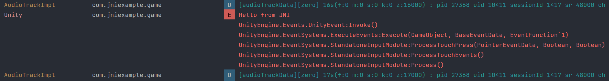
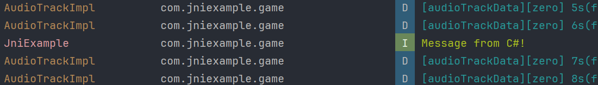
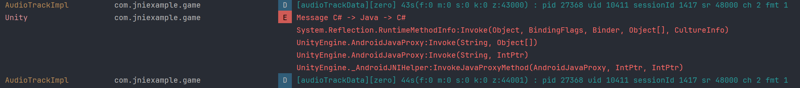

# C#/Java/Cpp Communication in Unity on Android

## How to Use

1. Open the **AndroidAar** folder with Android Studio and build it into an AAR file.
2. Create a Unity project by yourself and add the AAR file to your project.
3. Copy the three C# scripts from **GameScripts** folder into your Unity project. The file named **DemoMonoBehaviour** is a MonoBehaviour class with three serialized buttons, you can create three buttons in your scene and assign them to this script.
4. Build your Unity project to an APK, run it on your Android device, click three buttons to observe the results in logcat.

## Effects Achieved

First button, A string is returned from JNI to Java
, then form Java to C#, and finally displayed in log. You can see it in logcat:

Second button, a string is sent from C# to Java to C++, and shown in logcat:

Third button, a string is sent from C# to Java, and then Java call C# to send this string back to C#, which is logged in C# as belows:

